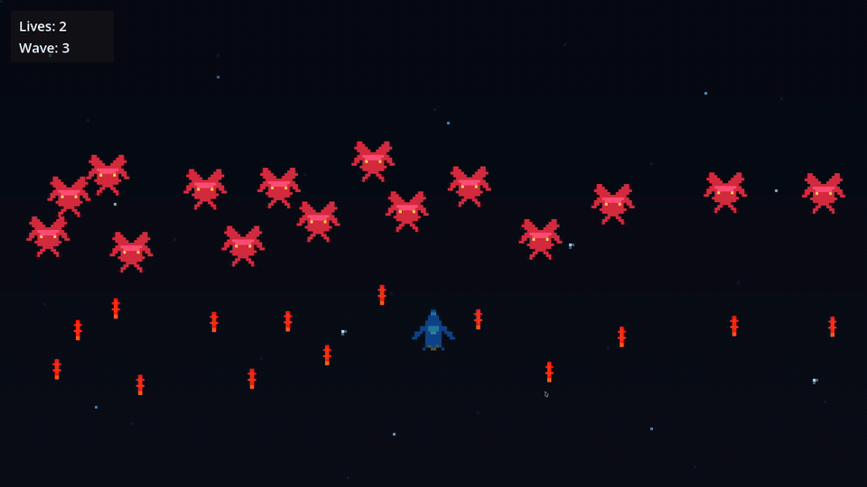

# Mini Space Wars

A small, completable 2D vertical space shooter made with **Godot 4** and **GDScript**.
Clear three enemy waves with a single ship in a short, arcade-style run.

## Download & Play

Grab the latest build from the [**Releases**](https://github.com/AlgoRogue/mini-space-wars/releases/latest) page:

- **Windows (x86_64):** `MiniSpaceWars-windows.zip` — unzip and run `MiniSpaceWars.exe`.
- **macOS (universal):** `MiniSpaceWars-macOS.zip` — unzip and open `MiniSpaceWars.app`.

> The builds are not code-signed. On **macOS**, right-click the app → **Open** to get past Gatekeeper.
> On **Windows**, choose **More info → Run anyway** if SmartScreen warns.

## Controls

| Action | Key |
|--------|-----|
| Move   | `W` `A` `S` `D` |
| Fire   | hold `Space` |

## Gameplay

- Survive **3 waves** of enemies (3, then 5, then 7). Clear all waves to win.
- You start with **3 lives**; enemy fire and enemy contact each cost 1 life.
- After taking damage you get brief invulnerability before you can be hit again.
- A full run takes about **2–4 minutes**.

## Run from source

1. Install [Godot 4.7](https://godotengine.org/download).
2. Open this project in Godot (`project.godot`).
3. Press **F5** to play.

## Tech stack

- Godot 4.x, GDScript
- `Area2D`-based collision detection
- Godot signals for cross-scene communication

## Documentation

Design and planning documents live in [`docs/`](docs/):
[PRD](docs/PRD.md) · [GDD](docs/GDD.md) · [TDD](docs/TDD.md) · [Task Plan](docs/TASK_PLAN.md)

## License

Released under the [MIT License](LICENSE).
